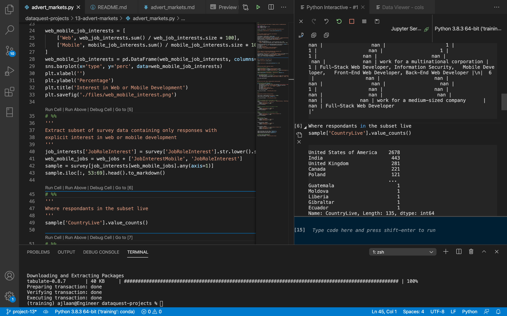

# I am trying something new!

## Where is the Jupyter Notebook?!

The previous guided projects in this repo have been completely self-contained in a Jupyter Notebook. Jupyter is certainly useful for what I would term exploratory data analysis; the kind of analysis where you just want to pile some data into a DataFrame for a 'go-look-see'. In some of the background reading I have been doing though, there are some downsides that can be rather counter-productive, namely:

- Code cells, while very useful for playing around with code, do leave you exposed to a hidden state that can make broken code look like it works properly!
- The meta data in the json structure of Jupyter notebooks can play havoc on version controlling in Github, particulary for a change that doesn't involve any of the code.
- Jupyter notebooks don't seem to want to render on my Github (my own issue, but I don't think it's uncommon).

These are just a couple of the common gripes. So, to expand my horizons and to make sure I'm not heavily reliant on using Jupyter to produce some analysis and document it, I have tried a different approach for this project:

- All the Python code is stored in a .py file (though I'm being cheeky and making use of VSCode's code cell functionality with a linked iPython shell). I've re-run the *whole* script file before committing this project, honest.
- The project is documented in a .md file, with code snippets pasted in for reporting purposes only (it can't run and break any outputs); outputs are pulled in as image files (graphs) or formatted as markdown tables (for those famous df.head()s).

*VSCode setup with script file and interactive shell*

## What have I learned?

- It took some time to get used to a different way of exploring a data set; Jupyter does feel like a simpler way to dive into the deep end.
- In contrast I don't think it actually took me significantly longer to work through this guided project once I got into the flow of things.
- It felt like a more versatile engineering environment for analysing data: I could build up a script file while working through the project with a linked interactive Python shell, I could use the shell to play around with the data REPL style before adding code to the script file, and the variable viewer is always handy.
- In having a separate markdown file for my reporting, I felt I was more considered with my wording and could be more organised with the layout.
- Tabular data (especially from DataFrame.to_markdown()) can **massively** clutter the markdown environment! I also needed to do a find-replace on all the '`\n`'s produced in the Python output for my markdown file; this is a definite waste of effort that you don't have to deal with in Jupyter. In addition, there isn't a concrete link between tabular output from the script and what is in the markdown file, unlike graph images; I'll need to see if I can do better here.
- It was a more complicated structure, going from a single Jupyter file (plus data) to the data, a Python file, a markdown file, and graph image files pulled into the markdown document. But it was still much quicker to put together than an MS Word document!

## Do I like this approach?

**Sure. I think so. Probably.**

As with any new way of doing things you really need to give yourself enough time and opportunities to stick to it for a while, and settle into your own flavour of the process. Expect the next few guided projects to be built in this way before I review whether I definitely prefer one approach over another, and for what types of project.