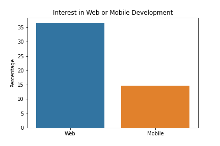
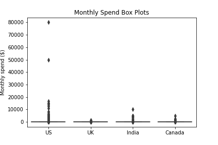
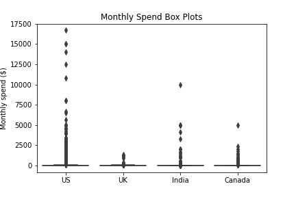
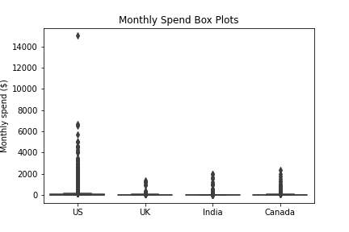

# Finding Markets to Advertise e-Learning Products

## Introduction
This project is for a fictional e-learning company that offers online courses in programming, primarily in web and mobile development. The product is a subscription service that charges $59 per month. The company would like to invest in advertising and is looking to choose two markets to advertise in.

Data to answer this objective can be obtained by collecting new survey data across a range of markets, or applicable existing publically available data can be used. The latter is preferred since it can costly and time consuming to launch a brand new survey and to collect the data. A candidate source of existing data comes from a [freeCodeCamp survey](https://www.freecodecamp.org/news/take-the-2017-new-coder-survey-and-help-us-build-a-massive-public-dataset-8c808cbee7eb/) from 2017. The [survey data](https://github.com/freeCodeCamp/2017-new-coder-survey) obtained contains more than 18000 entries from new coders with varying interests.

The population of interest is new coders who are interested in learning about web or mobile development. To determine markets to consider advertising in, it is worth understanding:

- Where new coders in the population are located.
- Which locations have the greatest numbers of new coders.
- How much money new coders are willing to spend on learning.

Python code is included in blockquotes as part of the reporting. See [advert_markets.py](./advert_markets.py) for the full Python script to reproduce the analysis and output documented herein.

### Summary Conclusions

Summary of countries with the most residents (as a percentage of sample) and average monthly spend on learning (in USD):

| Country | Percentage Living in Country | Average Monthly Spend per Person |
| --: | --: | --: |
| USA | 45% | $165 |
| India | 7% | $65 |
| UK | 5% | $49 |
| Canada | 4% | $105 |

The survey data and analysis implies the following:

- It is worth investing in advertising in the USA.
- Supplementary data could be used to expand on this analysis and determine potential domestic markets (e.g. 2-4 states) for more targetted advertising. With the number of residents representing nearly half the sample, advertising could potentially be entirely focussed on domestic markets in the USA.
- UK learners are unlikely to be willing to buy our product.
- Deeper analysis of the spend distributions for India and Canada may show, on balance, which of Canada (with its higher average spend per person) or India (with its higher number of new coder residents) could be a preferred market to advertise in.

Insight from a marketing team would be an added benefit to include some key domain context to this analysis.

## Initial Data Exploration

Initial exploration of the `JobRoleInterest` column shows that around 20% on respondents are solely interested in web development. This column does allow for multiple entries though, so a simple frequency table does not provide an easily digestible picture of the diversity of interests.

```py
import pandas as pd
import matplotlib.pyplot as plt
import seaborn as sns

survey = pd.read_csv('./files/2017-fCC-New-Coders-Survey-Data.csv')

print(survey['JobRoleInterest'].value_counts(normalize=True))
```

```
Full-Stack Web Developer                                                                                                       0.117706
  Front-End Web Developer                                                                                                      0.064359
  Data Scientist                                                                                                               0.021739
Back-End Web Developer                                                                                                         0.020309
  Mobile Developer                                                                                                             0.016733
                                                                                                                                 ...   
Back-End Web Developer,   DevOps / SysAdmin,   Data Scientist                                                                  0.000143
Digital Humanitites                                                                                                            0.000143
  Mobile Developer,   User Experience Designer, Full-Stack Web Developer, Back-End Web Developer,   Front-End Web Developer    0.000143
Back-End Web Developer,   User Experience Designer, Data Engineer, Full-Stack Web Developer                                    0.000143
Robotics Process Automation Specialist                                                                                         0.000143
Name: JobRoleInterest, Length: 3213, dtype: float64
```

Considering web or mobile developer interests more closely, there are three three job types in the survey that fall within web development: `JobInterestBackEnd`, `JobInterestFrontEnd`, and `JobInterestFullStack`. There is one job type for mobile development: `JobInterestMobile`.

```py
'''
Extract columns related to specific job interests
and convert to boolean values
'''
job_interests = survey.iloc[:, 53:66].copy()
job_interests = job_interests.apply(lambda x: x == 1.0)
web_jobs = ['JobInterestBackEnd', 'JobInterestFrontEnd', 'JobInterestFullStack']
web_job_interests = job_interests[web_jobs].any(axis='columns')
mobile_job_interests = job_interests['JobInterestMobile']

web_mobile_job_interests = [
    ['Web', web_job_interests.sum() / web_job_interests.size * 100],
    ['Mobile', mobile_job_interests.sum() / mobile_job_interests.size * 100]
]
web_mobile_job_interests = pd.DataFrame(web_mobile_job_interests, columns=['type', 'perc']).reset_index()
sns.barplot(x='type', y='perc', data=web_mobile_job_interests)
plt.xlabel('')
plt.ylabel('Percentage')
plt.title('Interest in Web or Mobile Development')
plt.savefig('./files/web_mobile_interest.png')
```


Summarising respondent interest in web development jobs shows that just over 35% of new coders surveyed are interested in a web development job, and around 15% are interested in a mobile development job. While less than half of respondents have expressed an explicit interest in web or mobile development jobs, a subset of the survey containing the coders who have expressed this interest would be a useful sample for determining the information we seek from the population of interest.

## Deriving a Sample of the Population of Interest

The population of interest is all new coders who are interested in training for web or mobile development jobs. Around 2/3 of the survey entries do not have an explicit interest in job roles, either in the individual columns or in the `JobRoleInterest` combined column. To focus the analysis that follows on the population of interest, a sample is derived from the full survey data containing only entries that have expressed an interest in web or mobile development jobs. It is acknowledged that this approach may be too focussed: there could be respondants who are actually interested in these types of jobs but did not express them; there may also be respondants who expressed a different interest who may later become interested in web or mobile development (possibly as a direct result of our advertising!). However, this approach for sampling still produces a sample size of nearly 5400 data points, so good pedigree and robustness can be expected from the analysis results.

To derive the sample data:

```py
job_interests['JobRoleInterest'] = survey['JobRoleInterest'].str.lower().str.contains(r'web|mobile')
web_mobile_jobs = web_jobs + ['JobInterestMobile', 'JobRoleInterest']
sample = survey[job_interests[web_mobile_jobs].any(axis=1)]
```

|    |   JobInterestBackEnd |   JobInterestDataEngr |   JobInterestDataSci |   JobInterestDevOps |   JobInterestFrontEnd |   JobInterestFullStack |   JobInterestGameDev |   JobInterestInfoSec |   JobInterestMobile |   JobInterestOther |   JobInterestProjMngr |   JobInterestQAEngr |   JobInterestUX | JobPref                              |   JobRelocateYesNo | JobRoleInterest                                                                                                       |
|---:|---------------------:|----------------------:|---------------------:|--------------------:|----------------------:|-----------------------:|---------------------:|---------------------:|--------------------:|-------------------:|----------------------:|--------------------:|----------------:|:-------------------------------------|-------------------:|:----------------------------------------------------------------------------------------------------------------------|
|  1 |                  nan |                   nan |                  nan |                 nan |                   nan |                      1 |                  nan |                  nan |                 nan |                nan |                   nan |                 nan |             nan | work for a nonprofit                 |                  1 | Full-Stack Web Developer                                                                                              |
|  2 |                    1 |                   nan |                  nan |                   1 |                     1 |                      1 |                  nan |                  nan |                   1 |                nan |                   nan |                 nan |             nan | work for a medium-sized company      |                  1 | Front-End Web Developer, Back-End Web Developer,   DevOps / SysAdmin,   Mobile Developer, Full-Stack Web Developer    |
|  3 |                    1 |                   nan |                  nan |                 nan |                     1 |                      1 |                  nan |                  nan |                 nan |                nan |                   nan |                 nan |             nan | work for a medium-sized company      |                nan | Front-End Web Developer, Full-Stack Web Developer, Back-End Web Developer                                             |
|  4 |                    1 |                   nan |                  nan |                 nan |                     1 |                      1 |                  nan |                    1 |                   1 |                nan |                   nan |                 nan |             nan | work for a multinational corporation |                  1 | Full-Stack Web Developer, Information Security,   Mobile Developer,   Front-End Web Developer, Back-End Web Developer |
|  6 |                  nan |                   nan |                  nan |                 nan |                   nan |                      1 |                  nan |                  nan |                 nan |                nan |                   nan |                 nan |             nan | work for a medium-sized company      |                nan | Full-Stack Web Developer                                                                                              |

## Exploring New Coder Locations

With our sample subset of survey data, the `CountryLive` column is explored to see which countries new coders interested in web or mobile development live in. For the moment a country is considered as a potential market for investing in advertising the company's product.

Nearly 2700 (or 45%) of our sample live in the USA. 7%, 5%, and 4% respectively live in India, the UK, and Canada. Advertising efforts could be split between the USA and India. However, with such a large proportion of these new coders living in the USA, it would be worth investigating deeper into where within the USA these new coders live. It is possible that smaller markets within the USA could have greater new coder numbers than any other country on the survey, in which case advertising efforts could be even more targeted.

Unfortunately, there is no data in the survey that provides a more precise location for where respondants live. For the purposes of continuing this project, analysis will carry on at a country level for respondant geography. A potential expansion to this analysis would be to supplement the freeCodeCamp survey data with additional data specific to the USA.

```py
sample['CountryLive'].value_counts()
```

```
United States of America    2678
India                        443
United Kingdom               281
Canada                       221
Poland                       121
                            ... 
Samoa                          1
Vanuatu                        1
Bolivia                        1
Trinidad & Tobago              1
Bahrain                        1
Name: CountryLive, Length: 135, dtype: int64
```

```py
sample['CountryLive'].value_counts(normalize=True) * 100
```

```
United States of America    45.336042
India                        7.499577
United Kingdom               4.757068
Canada                       3.741324
Poland                       2.048417
                              ...    
Samoa                        0.016929
Vanuatu                      0.016929
Bolivia                      0.016929
Trinidad & Tobago            0.016929
Bahrain                      0.016929
Name: CountryLive, Length: 135, dtype: float64
```

## Average Monthly Spend

Average monthly spend on learning, per country, is explored next. This will help build a picture of how much on average a new coder is willing to spend on learning resources alongside how many new coders reside in a given country. This analysis is focussed on the four countries highlighted previously as potential markets for advertising, but could be expanded to consider other countries.

Even with the reduced sample from the full survey, there are null entries in `CountryLive`, `MonthsProgramming`, or `MoneyForLearning` columns. Rows from the sample are removed where these entries are null so that the aggregation can be completed.

```py
# calculate spend per month
sample['MonthlySpend'] = sample['MonthsProgramming'].copy()
sample['MonthlySpend'].loc[sample['MonthlySpend'] == 0] = 1
sample['MonthlySpend'] = sample['MoneyForLearning'] / sample['MonthlySpend'].copy()

# drop rows with null MonthlySpend or CountryLive entries
sample.dropna(subset=['MonthlySpend', 'CountryLive'], inplace=True)

# this information is extracted again later
def top_4_mean_spend(df):
    mean_spend_by_country = df.groupby(['CountryLive']).agg('mean')['MonthlySpend']
    return mean_spend_by_country.loc[['United States of America', 'India', 'United Kingdom', 'Canada']]

top_4_mean_spend(sample)
```

```
CountryLive
United States of America    249.329094
India                       146.663700
United Kingdom               49.117435
Canada                      129.170946
Name: MonthlySpend, dtype: float64
```

This indicates that for these countries there is a willingness on average to spend $249 per month on learning to code in the USA, but just $49 per month in the UK. $129 per month for Canada is also low for a country that supposedly has a higher GDP per capita than India. Box plots of the monthly spend for these four countries can is shown below to visualise individual distributions.

```py
# this box plot is repeated later
def top_4_box_plot(df, filename: str):
    four_countries = df[df['CountryLive'].str.contains(r'United States of America|India|United Kingdom|Canada')]
    sns.boxplot(x='CountryLive', y='MonthlySpend', data=four_countries)
    plt.xticks(range(4), ['US', 'UK', 'India', 'Canada'])
    plt.xlabel('')
    plt.ylabel('Monthly spend ($)')
    plt.title('Monthly Spend Box Plots')
    plt.savefig(filename)

top_4_box_plot(sample, './files/box_plot_1.png')
```



The monthly spend distributions for each of these countries shows clear positive skew with some extreme outliers, particularly the two data points above $40,000 in the USA's distribution. These two are removed from the sample and the box plots reproduced.

```py
rows_to_drop = sample[sample['MonthlySpend'] > 40000]
sample.drop(rows_to_drop.index, inplace=True)

top_4_box_plot(sample, './files/box_plot_2.png')
```



Now the plots show that there are a number of outliers for India where monthly spend is greater than $2500. This could be justified if these respondants attended a bootcamp, but would seem like a very high cost otherwise.

```py
# identify potential outliers from India to remove
cols = ['AttendedBootcamp', 'BootcampFinish', 'MoneyForLearning', 'MonthsProgramming', 'MonthlySpend']
sample[
    (sample['CountryLive'] == 'India') &
    (sample['MonthlySpend'] > 2500)
][cols].to_markdown()
```

|       |   AttendedBootcamp |   BootcampFinish |   MoneyForLearning |   MonthsProgramming |   MonthlySpend |
|------:|-------------------:|-----------------:|-------------------:|--------------------:|---------------:|
|  1728 |                  0 |              nan |              20000 |                   4 |        5000    |
|  1755 |                  0 |              nan |              50000 |                  15 |        3333.33 |
|  7989 |                  0 |              nan |               5000 |                   1 |        5000    |
|  8126 |                  0 |              nan |               5000 |                   1 |        5000    |
| 13398 |                  0 |              nan |              20000 |                   2 |       10000    |
| 15587 |                  0 |              nan |             100000 |                  24 |        4166.67 |

None of these respondants attended a bootcamp, so these rows can be removed.

Similarly, there appears to be one outlier at around $5000 per month in Canada.

```py
# identify potential outliers from Canada to remove
sample[
    (sample['CountryLive'] == 'Canada') &
    (sample['MonthlySpend'] > 4500)
][cols].to_markdown()
```

|       |   AttendedBootcamp |   BootcampFinish |   MoneyForLearning |   MonthsProgramming |   MonthlySpend |
|------:|-------------------:|-----------------:|-------------------:|--------------------:|---------------:|
| 13659 |                  1 |                0 |              10000 |                   2 |           5000 |

This respondant did attend a bootcamp, but has not finished it yet. Since bootcamps tend to have a single up-front fee, this would suggest that this person's monthly spend is inflated, since their money spent should be spread out for the whole bootcamp. This row can also be dropped.

There are a number of US respondants who appear to be spending greater than $7000 per month. These rows are investigated further.

```py
# identify potential outliers from the US to remove
sample[
    (sample['CountryLive'] == 'United States of America') &
    (sample['MonthlySpend'] > 7000)
][cols].to_markdown()
```

|       |   AttendedBootcamp |   BootcampFinish |   MoneyForLearning |   MonthsProgramming |   MonthlySpend |
|------:|-------------------:|-----------------:|-------------------:|--------------------:|---------------:|
|   718 |                  1 |                0 |               8000 |                   1 |         8000   |
|  3930 |                  0 |              nan |              65000 |                   6 |        10833.3 |
|  6805 |                  1 |                1 |              15000 |                   1 |        15000   |
|  7198 |                  0 |              nan |              70000 |                   5 |        14000   |
|  9778 |                  1 |                0 |               8000 |                   1 |         8000   |
| 16650 |                  0 |              nan |             200000 |                  12 |        16666.7 |
| 16997 |                  0 |              nan |              12500 |                   1 |        12500   |
| 17231 |                  0 |              nan |              30000 |                   2 |        15000   |

Of these entries, three have attended a bootcamp; of these, only one has completed it; it is likely that the other two were in the middle of their respective bootcamps when they filled out the survey. It is difficult to justify the high spend on learning outside of a completed bootcamp as representative of the population, so with the exception of the one where the respondant completed their bootcamp, these rows can also be dropped.

Dropping the rows indicated for India, Canada, and the USA, and reproducing the aggregate data and box plots:

```py
# drop outlier rows
india_rows_drop = sample[
    (sample['CountryLive'] == 'India') &
    (sample['MonthlySpend'] > 2500)
]

canada_rows_drop = sample[
    (sample['CountryLive'] == 'Canada') &
    (sample['MonthlySpend'] > 4500)
]

usa_rows_drop = sample[
    (sample['CountryLive'] == 'United States of America') &
    (sample['MonthlySpend'] > 7000) &
    (sample['BootcampFinish'] != 1)
]

sample.drop(india_rows_drop.index, inplace=True)
sample.drop(canada_rows_drop.index, inplace=True)
sample.drop(usa_rows_drop.index, inplace=True)

# produce updated aggregate data
print(top_4_mean_spend(sample))
top_4_box_plot(sample, './files/box_plot_3.png')
```
```
CountryLive
United States of America    164.531948
India                        64.958227
United Kingdom               49.117435
Canada                      105.057931
Name: MonthlySpend, dtype: float64
```



There is still a large positive skew in these distributions, but based on mean monthly spend, the USA and Canada appear to be the two markets with the biggest average spending potential per person.

## Conclusions

Summary of countries with the most residents (as a percentage of sample) and average monthly spend on learning (in USD):

| Country | Percentage Living in Country | Average Monthly Spend per Person |
| --: | --: | --: |
| USA | 45% | $165 |
| India | 7% | $65 |
| UK | 5% | $49 |
| Canada | 4% | $105 |

Deriving a sample of new coders interested in web and mobile development from a [freeCodeCamp survey](https://www.freecodecamp.org/news/take-the-2017-new-coder-survey-and-help-us-build-a-massive-public-dataset-8c808cbee7eb/) from 2017 has shown that countries of potential interest for advertising our product are the USA, India, the UK, and Canada. The data shows that the USA has the lion's share of these new coders with 45% of the sample respondants located there. From derived average monthly spend on learning the USA is also on top with $165. This data implies then that it is worth investing in advertising in the USA.

The courses offered are charged at $59 per month, so while the UK is a sizeable potential market for advertising, the average monthly spend on learning implies an expectation that new coders in the UK would want to spend less than that. Thus, data suggests that the UK would not be a good candidate market to invest in advertising.

Between Canada and India, the sample suggests the potential market of new coders could be bigger in India, but that the potential spend could be greater in Canada. Some further investigation into the distributions of India resident and Canada resident learners could help determine whether the potential for customer revenue is greater, on balance, with one country or the other. The intent has been to determine two potential markets to invest in advertising, but perhaps an alternative option would be to split the advertising budget between the USA, India and Canada.

The USA is by far the largest market suggested by the sample for new coders interested in web and mobile development. Yet another alternative option could be to delve deeper into the USA with supplementary data to determine potential key domestic markets (e.g. specific states), focussing the entire advertising budget on the USA to, say, 2-4 specific states.

Finally, this analysis has not been completed by a marketing expert. Consulting with a marketing team would be beneficial for including some key domain knowledge and context to this analysis.